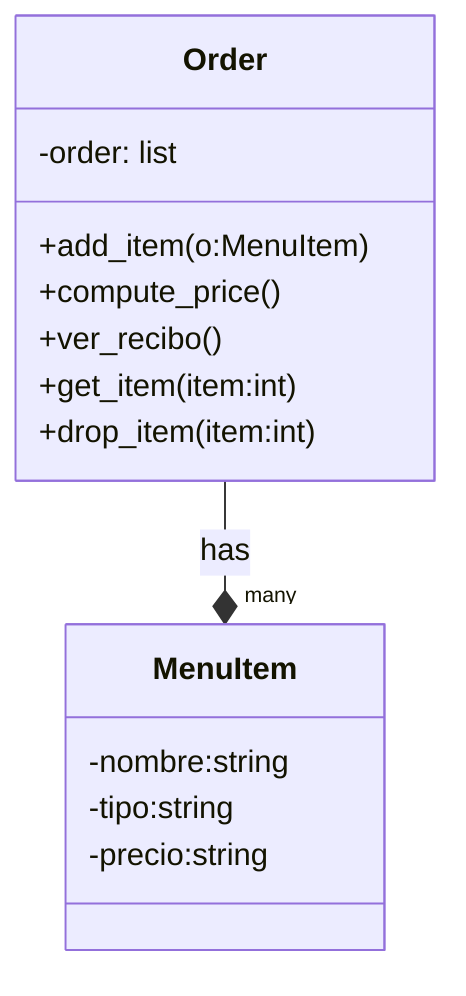
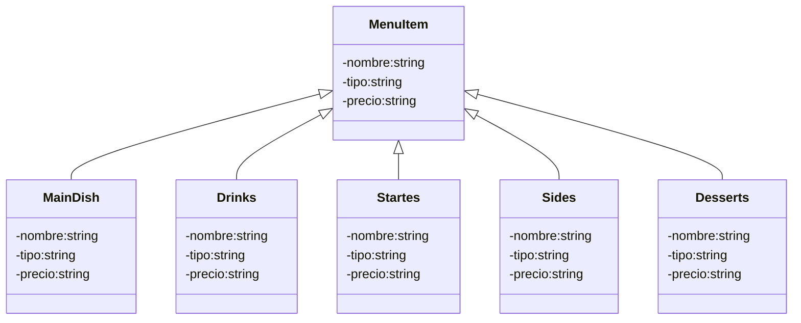

### Restaurante
## Relaión Order--MenuItem

```mermaid
classDiagram
    class Order {
      -order: list
      +add_item(o:MenuItem)
      +compute_price()
      +ver_recibo()
      +get_item(item:int)
      +drop_item(item:int)
    }
    class MenuItem {
      -nombre:string
      -tipo:string
      -precio:string
    }
    Order --* "many" MenuItem: has
```
## Relación MenuItem--subclases

```mermaid
classDiagram

    MenuItem <|-- MainDish
    MenuItem <|-- Drinks
    MenuItem <|-- Startes
    MenuItem <|-- Sides
    MenuItem <|-- Desserts

    
    class MenuItem {
      -nombre:string
      -tipo:string
      -precio:string
    }
    class MainDish {
      -nombre:string
      -tipo:string
      -precio:string
    }
    class Drinks {
          -nombre:string
          -tipo:string
          -precio:string
        }
    class Startes {
      -nombre:string
      -tipo:string
      -precio:string
    }
    class Sides {
      -nombre:string
      -tipo:string
      -precio:string
    }
    class Desserts {
      -nombre:string
      -tipo:string
      -precio:string
    }


```
